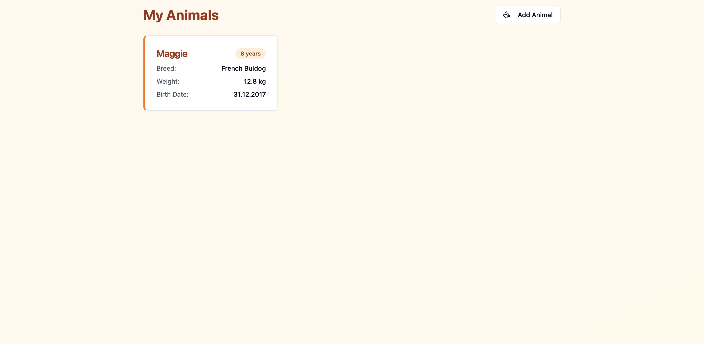
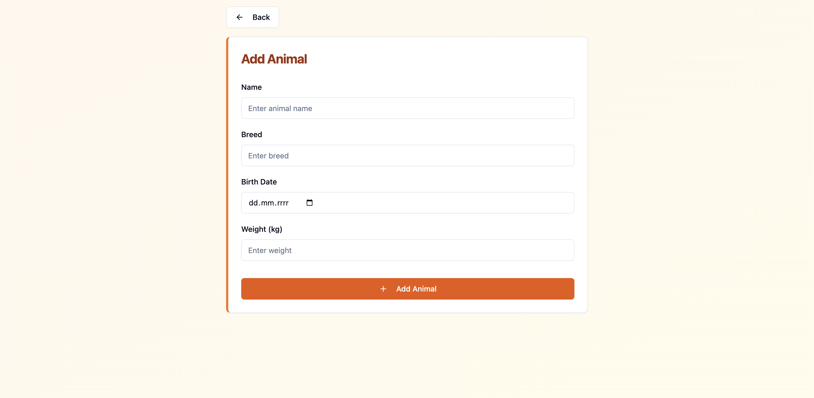
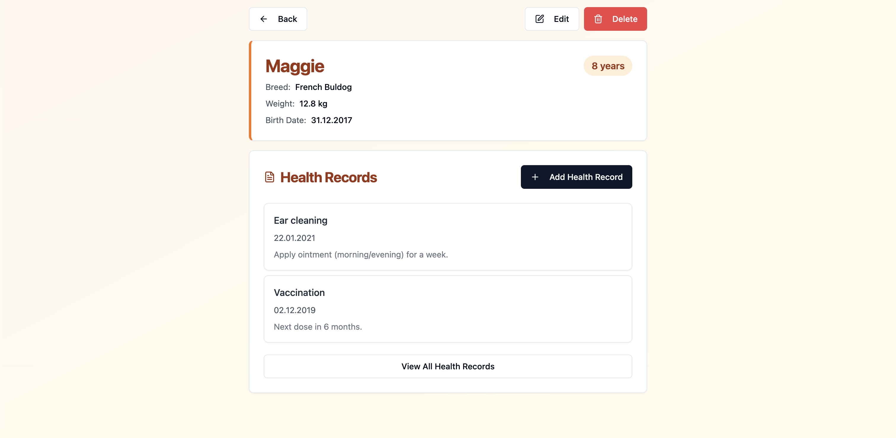

# PetLog

**PetLog** is a responsive and interactive pet management application built with **React** and **Vite**. Designed for a seamless user experience, it allows users to manage animals and keep health records with quick add/edit flows, confirmations, and toast notifications.

---

## **Features**

- **Animals management**:
  - Add / edit / delete animals
  - Animal details view with age badge and quick actions
- **Health records**:
  - List health records for an animal (sorted newest first)
  - Add / edit / delete health records
  - Search health records by **title** and **notes**
- **UX improvements**:
  - Confirmation dialogs before destructive actions (delete)
  - Toast notifications for success / error feedback
- **Persistence**:
  - Data is stored in **localStorage**

---

## **Technologies Used**

- **React**:  
  Component-based architecture for better reusability and maintainability.
- **Vite**:  
  A fast development environment for building modern web applications.
- **TypeScript**:  
  Type-safe development and better DX.
- **React Router**:  
  Client-side routing for screens and navigation.
- **Tailwind CSS**:  
  Utility-first styling for a clean and consistent UI.
- **shadcn/ui + Radix UI**:  
  Reusable UI components built on accessible primitives.
- **Sonner**:  
  Toast notifications (success/error).
- **lucide-react**:  
  Icon library used across the UI.
- **npm**:  
  Package management and project scripts.

---

## **Screenshots**

### **Animals List**

Main screen with animals list and the primary “Add Animal” action.


### **Add Animals**

Form to add a new animal with fields for name, breed, birth date, and weight.


### **Animal Details**

Details view with actions (edit / delete) and quick access to health records.


---

## **Getting Started**

### **Prerequisites**

### Installation and Local Development

1. **Clone the repository**:

```bash
git clone https://github.com/KamilBarczyk/PetLog.git
```

2. **Navigate to the project folder:**

```bash
cd PetLog
```

3. **Install dependencies:**

```bash
npm install
```

4. **Run the project:**

```bash
npm run dev
```

The app will be available at http://localhost:5173.
